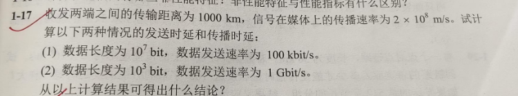
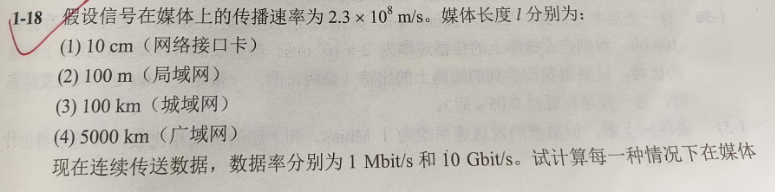

# 计算机网络基础 - 第一章习题

## 基础概念题
1. 试简述分组交换的要点。

2. 试从多个方面比较电路交换、报文交换和分组交换的主要优缺点。

3. 小写和大写开头的英文名 `internet` 和 `Internet` 在意思上有何重要区别？

4. 计算机网络都有哪些类别？各种类别的网络都有哪些特点？

5. 计算机网络有哪些常用的性能指标？

## 图示分析题
6. 请分析下图中的网络拓扑结构：

   

7. 给定以下传输媒体参数：

   

   现连续传输数据，试计算出当数据率为 1Mb/s 和 10Gb/s 时在以上媒体中正在传播的比特数。

## 计算题
8. **数据传输效率计算**

   已知条件：
   - 应用层数据长度：100字节
   - TCP首部：20字节
   - IP首部：20字节
   - 以太网首部和尾部：18字节
   
   请计算：
   1. 数据的传输效率
   2. 当应用层数据长度为1000字节时的传输效率
   
   > 注：数据传输效率 = 应用层数据 / 总数据量（应用数据+各种首部和尾部）

## 网络协议与体系结构
9. 网络协议的三个要素是什么？各有什么含义？

10. 论述具有五层协议的网络体系结构的要点，包括各层的主要功能。

11. 请解释以下网络术语：
    - 协议栈
      - 实现协议的软件模块
    - 实体
      - 任何可以发送信息或者接受信息的硬件或软件
    - 对等层
      - 通信双方同一层次的实体
    - 协议数据单元
      - 对等实体间传送的数据单位
    - 服务访问点
      - 相邻两层的接口
    - 客户
      - 请求服务的实体
    - 服务器
      - 提供服务的实体
    - 客户-服务器方式
      - 

## 综合应用题
12. **文件传输时间计算**
MB = 2^20 bit 
KB = 2^10 bit
    已知条件：
    - 文件大小：1.5MB
    - 分组长度：1KB
    - 往返时间(RTT)：80ms
    - TCP连接建立时间：2×RTT = 160ms

    请分别计算在以下情况下，接收方收完该文件的最后一个比特需要的时间：

    a) 数据发送速率为10Mbit/s，数据分组可以连续发送
    
    b) 数据发送速率为10Mbit/s，每发送一个分组后需等待一个RTT
    
    c) 数据发送速率极快（可忽略发送时间），但每个RTT内限制发送20个分组
    
    d) 数据发送速率极快（可忽略发送时间），且：
       - 第一个RTT内可发送1个分组
       - 第二个RTT内可发送2个分组
       - 第三个RTT内可发送4个分组
       - 以此类推

