# 计算机网络基础 - 第三章习题

## 数据链路层基础
### 3-01 链路概念
请说明：
1. 数据链路（即逻辑链路）与链路（即物理链路）有何区别？
2. "链路接通了"与"数据链路接通了"的区别何在？
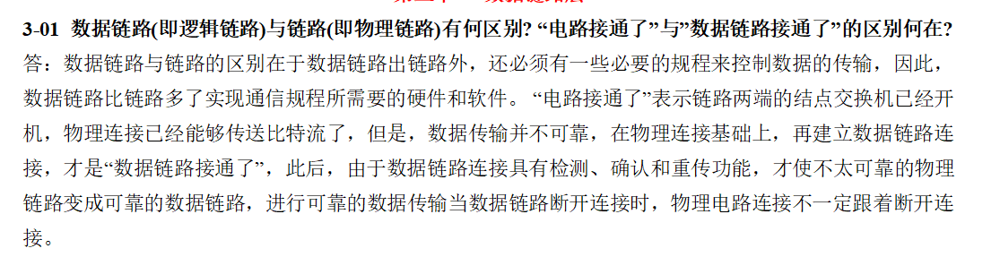
### 3-02 链路控制
请讨论：
1. 数据链路层中的链路控制包括哪些功能？
2. 数据链路层做成可靠的链路层有哪些优点和缺点?
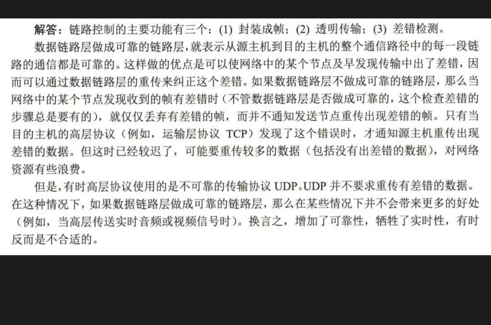
### 3-03 网络适配器
请回答：
1. 网络适配器的作用是什么？
2. 网络适配器工作在哪一层？
3. 

### 3-04 数据链路层三大问题
为什么以下三个问题都必须加以解决：
- 封装成帧
- 透明传输
- 差错检测
- 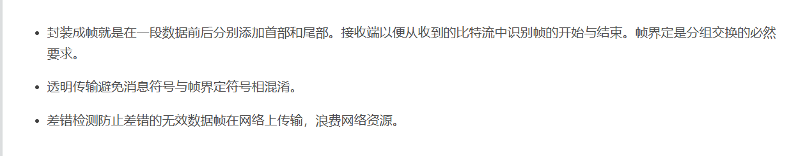

### 3-05 帧封装重要性
如果数据链路层不进行封装成帧，会发生什么问题？
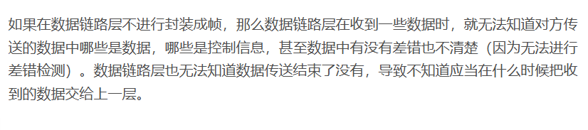
## PPP协议详解
### 3-06 PPP协议特点
请回答以下问题：
1. PPP协议的主要特点是什么？
2. 为什么PPP不使用帧的编号？
3. PPP适用于什么情况？
4. 为什么PPP协议不能使数据链路层实现可靠传输？
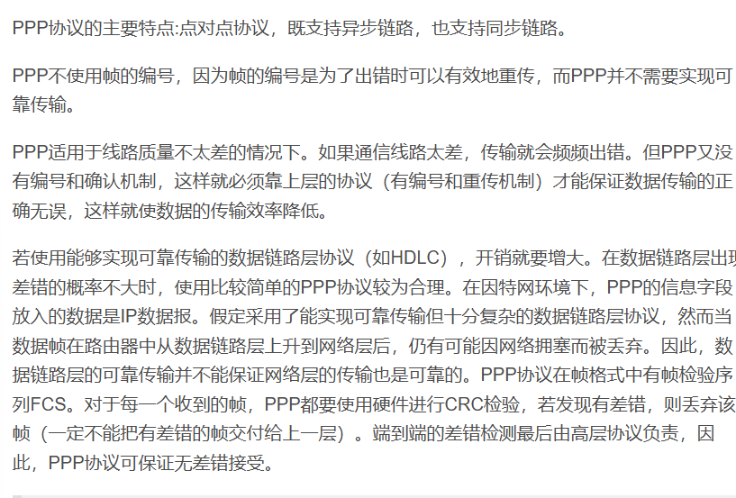
### 3-07 CRC
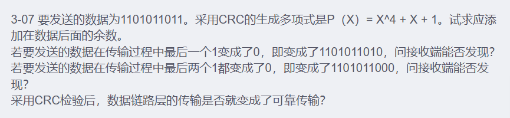
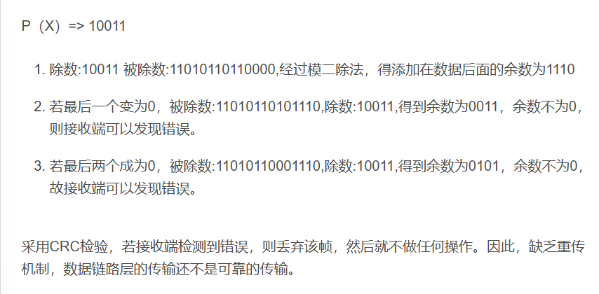
### 3-09 字节填充示例

> 根据字节填充的规则：
> - 遇到7E替换成7D 5E
> - 遇到7D替换成7D 5D
> 
> 所以真正的数据是：7E FE 27 7D 7D 65 7E

### 3-10 PPP协议详解
详细说说PPP协议

### 3-12 PPP协议工作状态
请回答：
1. PPP协议的工作协议有哪几种？
2. 当用户要使用PPP协议和ISP建立连接进行通信时，需要建立哪几种连接？
3. 每一种连接解决什么问题？

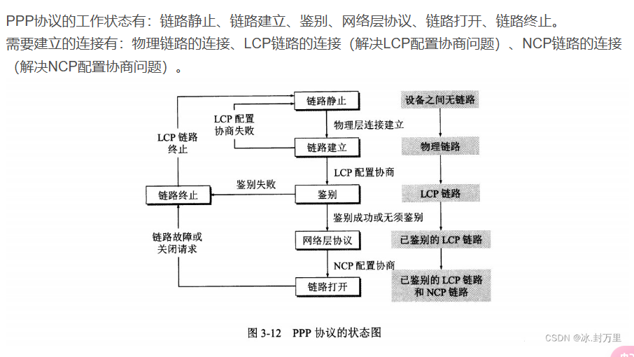

## 局域网技术
### 3-13 局域网特点
请讨论：
1. 局域网的主要特点是什么？
2. 为什么局域网采用广播通信方式而广域网不采用呢？
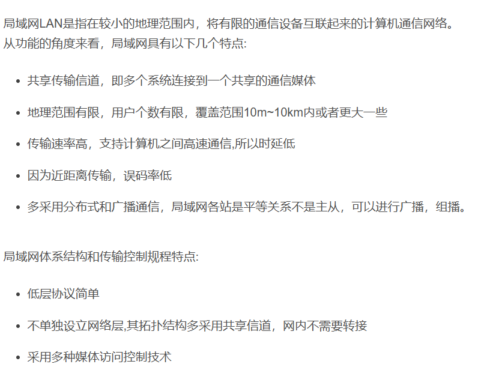
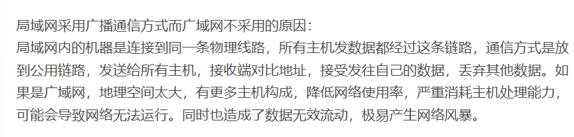
### 3-14 局域网拓扑结构
请回答：
1. 常用的局域网的网络拓扑有哪些种类？
2. 现在最流行的是哪种结构？
3. 为什么早期的以太网选择总线拓扑结构而不使用星形拓扑结构，但现在却改为使用星形拓扑结构呢？
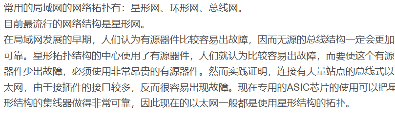
## 以太网与CSMA/CD
### 3-16 以太网码元速率
数据率为10Mbit/s的以太网在物理媒体上的码元传输速率（即码元/秒）是多少？
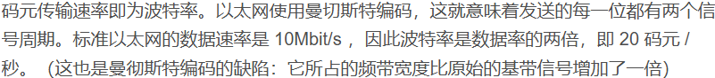
### 3-18 以太网命名解析
试说明 10BASE-T 中的"10"、"BASE"、"T"所代表的意思？
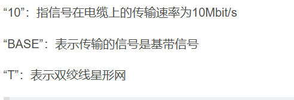
### 3-19 CSMA/CD与TDM对比
以太网使用的CSMA/CD协议是以争用方式接入到共享信道的，这与传统的时分复用TDM相比有何优缺点？
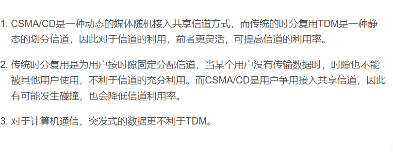
### 3-20 最短帧长计算
已知条件：
- 网络长度：1km
- 数据率：1 Gbit/s
- 信号传播速率：200000 km/s

求：能够使用此协议的最短帧长？
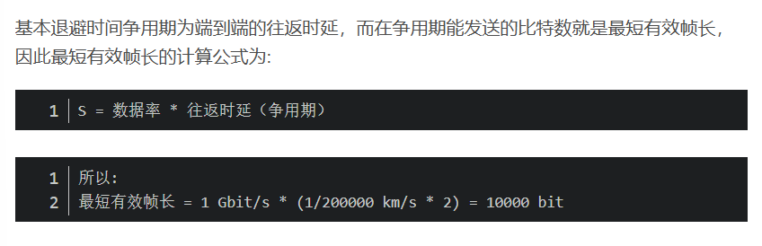
### 3-21 比特时间
请回答：
1. 什么叫做比特时间？
2. 使用这种时间单位有什么好处？
3. 100比特时间是多少微秒？

### 3-22 退避算法时间计算
假定在使用CSMA/CD协议的以太网中某个站在发送数据时检测到碰撞，执行退避算法时选择了随机数 r = 100。

请计算在以下情况下需要等待多长时间才能再次发送数据：
1. 10Mbit/s的以太网
2. 100Mbit/s的以太网
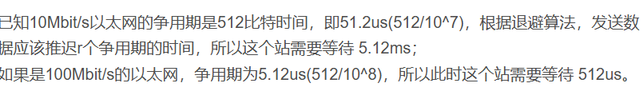
### 3-24 碰撞检测分析
已知条件：
- 站点A和B在同一个10Mbit/s的以太网段上
- 两站点间的传播时延为225比特时间
- A开始发送一帧，在A发送结束之前B也发送一帧
- A发送的是以太网所容许的最短的帧

请分析：
1. A在检测到和B发生碰撞之前能否把自己的数据发送完毕？
2. 如果A在发送完毕之前并没有检测到碰撞，那么能否肯定A所发送的帧不会和B发送的帧发生碰撞？

> 提示：在计算时应当考虑到每一个以太网帧在发送到信道上时，在MAC帧前面还要增加若干字节的前同步码和帧界定符
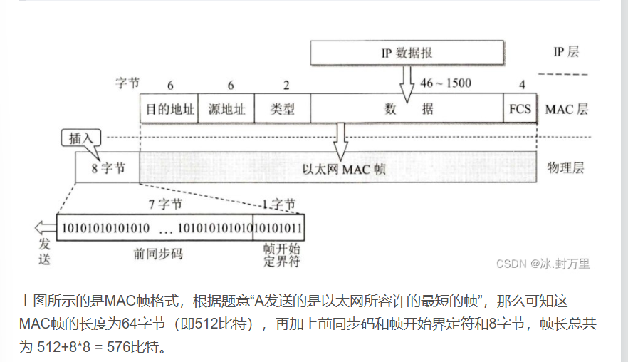
### 3-27 带宽计算
有10个站连接到以太网上。试计算以下三种情况每一个站所能得到的带宽：
1. 10个站都连接到一个10Mbit/s以太网集线器
2. 10个站都连接到一个100Mbit/s的以太网集线器上
3. 10个站都连接到一个10Mbit/s的以太网交换机上
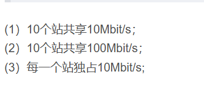
### 3-29 以太网交换机
请回答：
1. 以太网交换机有何特点？
2. 用它怎样组成虚拟局域网？
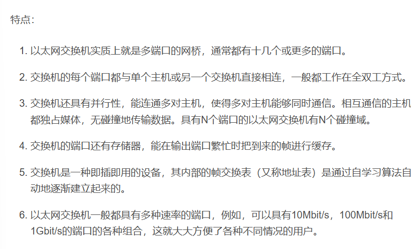