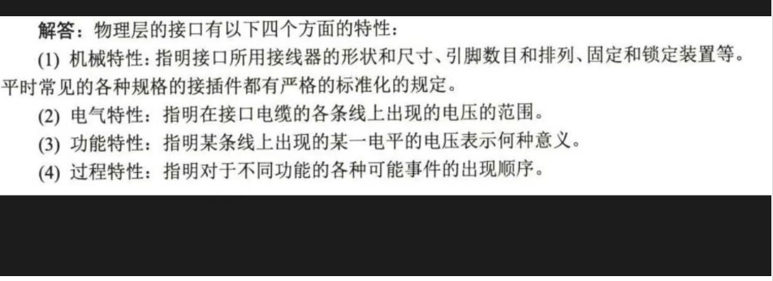

# 计算机网络基础 - 第二章答案

## 物理层基础概念
### 2-01 物理层基本问题
1. **物理层要解决的问题**：
   - 机械特性：接口形状、尺寸、引脚数量和排列等
   - 电气特性：电压范围、传输速率、距离限制等
   - 功能特性：各个引脚的功能定义
   - 过程特性：信号的建立、维持、释放等操作时序

2. **物理层主要特点**：
   - 主要定义物理设备如何传输比特流
   - 直接面向传输媒体
   - 为数据链路层提供物理连接
   - 不关心传输的数据内容和格式

### 2-04 基础术语解释

**数据与信号类型**：
- 数据：传送信息的实体
- 信号：数据的电气或电磁表现形式
- 模拟数据：连续变化的数据，如声音、图像
- 模拟信号：连续变化的信号，用于表示模拟数据
- 基带信号：原始数字信号，未经过调制
- 带通信号：经过调制后的信号，适合在特定频带传输
- 数字数据：离散的数据，如计算机中的二进制数据
- 数字信号：离散的信号，用高低电平表示
- 码元：表示一个固定时长的信号波形，可以携带一个或多个比特信息

**通信方式**：
- 单工通信：只能在一个方向上传输，如广播
- 半双工通信：可以双向传输，但同一时刻只能一个方向，如对讲机
- 全双工通信：可以同时双向传输，如电话

**传输方式**：
- 串行传输：数据按位依次传输
- 并行传输：多个比特同时在并行线路上传输

### 2-05 物理层接口特性
物理层接口包含四个方面的特性：

## 传输媒体与信道复用
### 2-10 传输媒体
常用传输媒体及特点：

1. **双绞线**：
   - 优点：价格便宜，安装简单
   - 缺点：抗干扰能力较弱，传输距离有限
   - 应用：局域网、电话网

2. **同轴电缆**：
   - 优点：抗干扰能力强，带宽大
   - 缺点：价格较高，安装不便
   - 应用：有线电视网络

3. **光纤**：
   - 优点：带宽极大，抗干扰性强，保密性好
   - 缺点：造价高，连接复杂
   - 应用：骨干网络，高速传输

4. **无线传输媒体**：
   - 无线电波：适合全向传播
   - 微波：适合点对点传输
   - 红外线：适合短距离传输
   - 激光：适合高速点对点传输

### 2-13 信道复用技术
1. **使用信道复用的原因**：
   - 提高信道利用率
   - 降低通信成本
   - 有效利用有限的频谱资源
   - 增加系统容量

2. **常用信道复用技术**：
   - 频分复用(FDM)：将频带分成多个子频带
   - 时分复用(TDM)：将时间划分为多个时隙
   - 波分复用(WDM)：在光纤中传输多个不同波长的光信号
   - 码分复用(CDM)：使用不同的码片序列区分用户

### 2-14 通信技术术语
**频分复用相关**：
- **FDM** (Frequency Division Multiplexing)：
  频分复用，将物理信道的频带宽度分成若干子频带，每个子频带传输一路信号

- **FDMA** (Frequency Division Multiple Access)：
  频分多址，将可用频带分配给多个用户，每个用户独占一个频带进行通信

**时分复用相关**：
- **TDM** (Time Division Multiplexing)：
  时分复用，将时间划分为多个等长的时隙，每个时隙传输一路信号

- **TDMA** (Time Division Multiple Access)：
  时分多址，将传输时间分配给多个用户，每个用户在指定时隙内发送数据

- **STDM** (Statistical Time Division Multiplexing)：
  统计时分复用，根据用户实际需求动态分配时隙，提高信道利用率

**波分复用相关**：
- **WDM** (Wavelength Division Multiplexing)：
  波分复用，在光纤中同时传输不同波长的光信号

- **DWDM** (Dense Wavelength Division Multiplexing)：
  密集波分复用，使用更密集的波长间隔，可传输更多路光信号

**码分复用**：
- **CDMA** (Code Division Multiple Access)：
  码分多址，使用不同的码片序列区分用户，允许多用户同时使用同一频带

**同步传输相关**：
- **SONET** (Synchronous Optical Network)：
  同步光纤网络，北美标准的光纤同步传输技术

- **SDH** (Synchronous Digital Hierarchy)：
  同步数字体系，国际标准的光纤同步传输技术

- **STM-1** (Synchronous Transport Module level-1)：
  同步传送模块1级，SDH的基本速率等级，155.52Mbit/s

- **OC-48** (Optical Carrier level 48)：
  光载波48级，SONET的一个速率等级，2.5Gbit/s

### 2-15 CDMA技术分析
1. **CDMA无干扰传输原理**：
   - 每个用户使用唯一的码片序列
   - 码片序列之间正交
   - 接收方使用相同码片序列解调
   - 利用扩频技术增强抗干扰能力

2. **CDMA优缺点**：
   优点：
   - 抗干扰能力强
   - 保密性好
   - 容量大
   - 软切换特性好

   缺点：
   - 实现复杂
   - 成本较高
   - 需要精确的功率控制
   - 近远效应问题

### 2-17 接入技术比较
1. **ADSL**：
   优点：
   - 利用现有电话线
   - 安装成本低
   - 上下行速率可调
   
   缺点：
   - 传输距离受限
   - 受线路质量影响大
   - 上行速率较低

2. **HFC**：
   优点：
   - 带宽大
   - 可提供多种服务
   - 覆盖范围广
   
   缺点：
   - 需要专门铺设同轴电缆
   - 上行带宽共享
   - 建设成本较高

3. **FTTx**：
   优点：
   - 带宽极大
   - 传输质量好
   - 可扩展性强
   
   缺点：
   - 建设成本高
   - 光纤到户改造工程量大
   - 维护要求高

### 2-14 通信技术术语
**频分复用相关**：
- **FDM** (Frequency Division Multiplexing)：
  频分复用，将物理信道的频带宽度分成若干子频带，每个子频带传输一路信号

- **FDMA** (Frequency Division Multiple Access)：
  频分多址，将可用频带分配给多个用户，每个用户独占一个频带进行通信

**时分复用相关**：
- **TDM** (Time Division Multiplexing)：
  时分复用，将时间划分为多个等长的时隙，每个时隙传输一路信号

- **TDMA** (Time Division Multiple Access)：
  时分多址，将传输时间分配给多个用户，每个用户在指定时隙内发送数据

- **STDM** (Statistical Time Division Multiplexing)：
  统计时分复用，根据用户实际需求动态分配时隙，提高信道利用率

**波分复用相关**：
- **WDM** (Wavelength Division Multiplexing)：
  波分复用，在光纤中同时传输不同波长的光信号

- **DWDM** (Dense Wavelength Division Multiplexing)：
  密集波分复用，使用更密集的波长间隔，可传输更多路光信号

**码分复用**：
- **CDMA** (Code Division Multiple Access)：
  码分多址，使用不同的码片序列区分用户，允许多用户同时使用同一频带

**同步传输相关**：
- **SONET** (Synchronous Optical Network)：
  同步光纤网络，北美标准的光纤同步传输技术

- **SDH** (Synchronous Digital Hierarchy)：
  同步数字体系，国际标准的光纤同步传输技术

- **STM-1** (Synchronous Transport Module level-1)：
  同步传送模块1级，SDH的基本速率等级，155.52Mbit/s

- **OC-48** (Optical Carrier level 48)：
  光载波48级，SONET的一个速率等级，2.5Gbit/s 