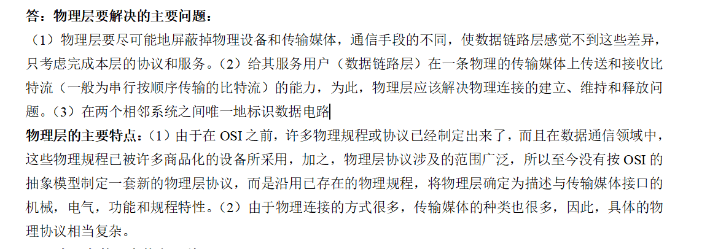

# 计算机网络基础 - 第二章习题

## 物理层基础概念
### 2-01 物理层基本问题
请回答以下问题：
1. 物理层要解决什么问题？

2. 物理层的主要特点是什么？

### 2-04 基础术语解释
请解释以下网络通信相关术语：
- 数据与信号
  - 数据
    - 传送数据的实体
  - 信号
    - 数据的电气或电磁的表现形式
  - 模拟数据
    - 连续变化的模拟信号
  - 模拟信号
    - 连续变化的信号
  - 基带信号
    - 没有经过任何处理的原始信号
  - 带通信号
    - 经过调制之后的信号
  - 数字数据
    - 离散的数据
  - 数字信号
    - 离散的信号
  - 码元
    - 表示一个固定时长的信号波形，可以携带一个或多个的bit
- 通信方式
  - 单工通信
    - 只能在一个方向上传播数据
  - 半双工通信
    - 可以双向进行传输，但是不能同时传输
  - 全双工通信
    - 可以进行同时双向传输
- 传输方式
  - 串行传输
    - 数据按位次进行传输
  - 并行传输
    - 多个比特同时在并行线路上传输

### 2-05 物理层接口特性
物理层的接口有哪几个方面的特性？各包含些什么内容?
1. 机械特性：
   1. 指明接口所用接线器的形状和尺寸，引脚数目和排列，固定和锁定装置等
2. 电气特性：指明电压的范围
3. 功能特性：指出某一个电平的电压表示什么意义
4. 规程特性：指明对于不同功能的各种可能事件出现的顺序
## 数据传输理论
### 2-06 传输速率影响因素
请回答以下问题：
1. 数据在信道中的传输速率受哪些因素的限制？
2. 信噪比能否任意提高？
3. 香农公式在数据通信中的意义是什么？
4. "比特/秒"和"码元/秒"有何区别？

### 2-07 奈氏准则应用题
已知条件：
- 信道最高码元速率：20000码元/秒
- 采用振幅调制
- 码元振幅划分为16个不同等级

问：可以获得多高的数据率(bit/s)？

### 2-08 电话信道传输计算
已知条件：
- 带宽：3 kHz
- 数据率：64kbit/s
- 要求：无差错传输

问：
1. 信道应具有多高的信噪比（用比值和分贝表示）？
2. 这个结果说明什么问题?

### 2-09 香农公式应用题
已知条件：
- 信道带宽：3100Hz
- 当前最大信息传输速率：35kbit/s

请计算：
1. 若要使最大信息传输速率增加60%，信噪比S/N应增大到多少倍？
2. 在上述基础上将信噪比S/N再增大到10倍，最大信息传输速率能否再增加20%？

## 传输媒体与信道复用
### 2-10 传输媒体
常用的传输媒体有哪几种？各有何特点？

### 2-13 信道复用技术
请回答：
1. 为什么要使用信道复用技术？
2. 常用的信道复用技术有哪些?

### 2-14 通信技术术语
请解释下列英文缩写的全称及含义：
- FDM
  - 
- FDMA
- TDM
- TDMA
- STDM
- WDM
- DWDM
- CDMA
- SONET
  - 同步光迁网络
- SDH
  - 同步数字体系
- STM-1
- OC-48

### 2-15 CDMA技术分析
请分析：
1. CDMA为什么可以使所有用户在同样的时间使用同样的频带进行通信而不会互相干扰？
2. 这种复用方法有何优缺点？

### 2-16 图示分析

### 2-17 接入技术比较
请比较以下接入技术的优缺点：
- ADSL
- HFC
- FTTx

