# 计算机网络基础 - 第五章习题

## 运输层基础概念
### 5-01 运输层定位
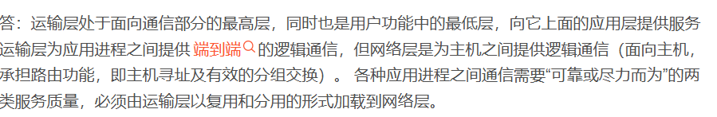

请回答：
1. 运输层在协议栈中的地位和作用是什么？
2. 运输层的通信和网络层的通信有什么重要区别？
3. 为什么运输层是必不可少的？

### 5-02 网络层服务影响
**问题**：网络层提供数据报或虚电路服务对上面的运输层有何影响？

### 5-03 连接性质分析
**问题**：当应用程序使用面向连接的TCP和无连接的IP时，这种传输是面向连接的还是面向无连接的？

## UDP与TCP特性
### 5-07 UDP可靠传输
**问题**：如果应用程序愿意使用UDP来完成可靠的传输，这可能吗？请说明理由。

### 5-08 面向特性比较
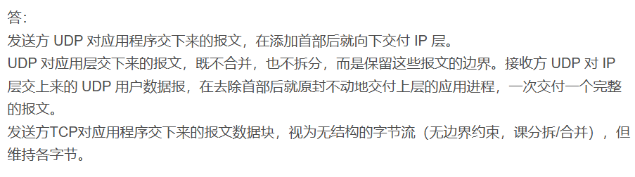

为什么说：
1. UDP是面向报文的？
2. TCP是面向字节流的？

### 5-09 端口概念
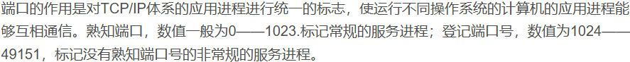

请回答：
1. 端口的作用是什么？
2. 为什么端口要划分为三种？
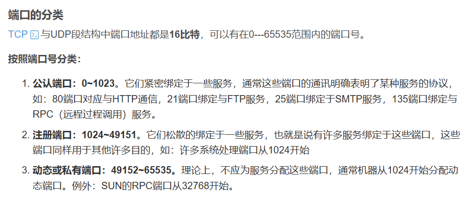
### 5-10 伪首部作用
**问题**：试说明运输层中伪首部的作用。

**答案**：用于计算运输层数据报校验和。

### 5-11 UDP功能分析
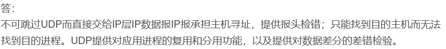

某个应用进程使用运输层的用户数据报UDP，然而继续向下交给IP层后，又封装成IP数据报。

请分析：
1. 既然都是数据报，可否跳过UDP而直接交给IP层？
2. 哪些功能UDP提供了但IP没提供？

## 协议实现机制
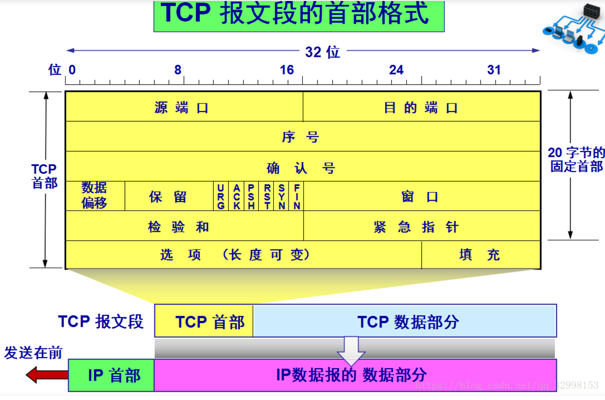
### 5-14 协议机制示例
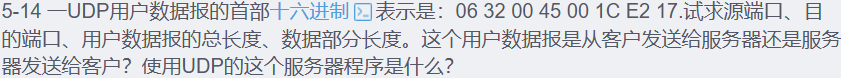
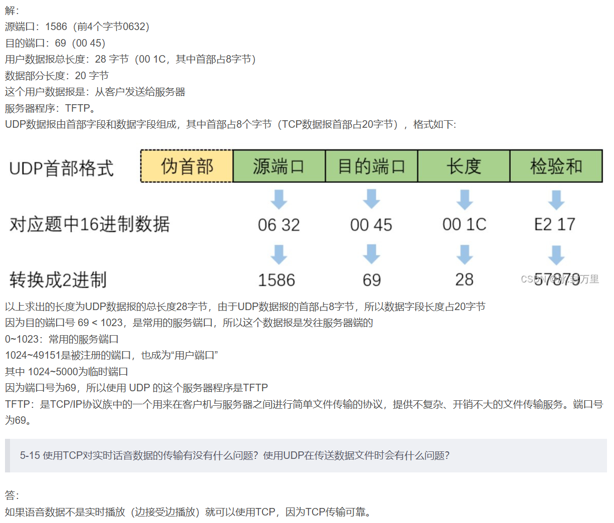

### 5-15 实时传输分析
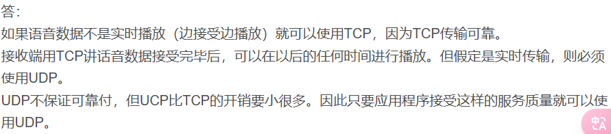

请分析：
1. 使用TCP对实时话音数据的传输有没有什么问题？
2. 使用UDP在传送数据文件时会有什么问题？

### 5-23 传输控制
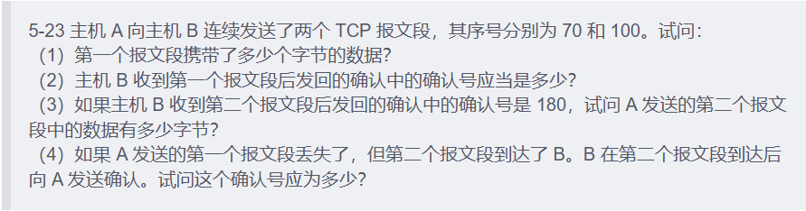
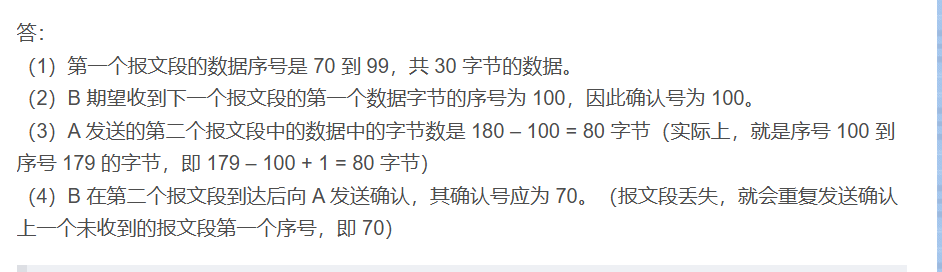

### 5-46 三次握手分析
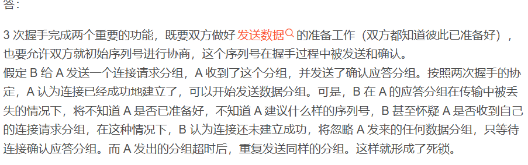

请说明：
1. 为什么在运输连接建立时要使用三次握手？
2. 如不这样做可能会出现什么情况？（请用具体例子说明）

### 5-49 连接管理
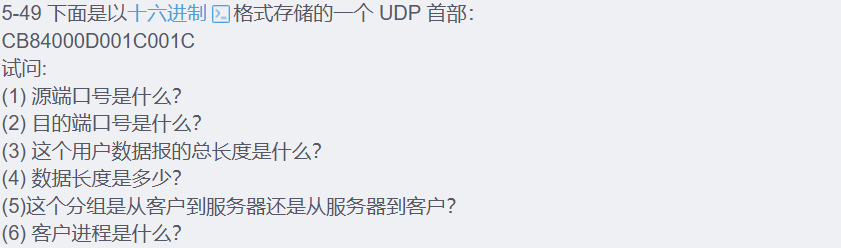
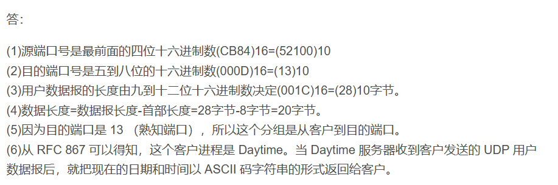

## 协议特性比较
### 5-52 可靠性比较
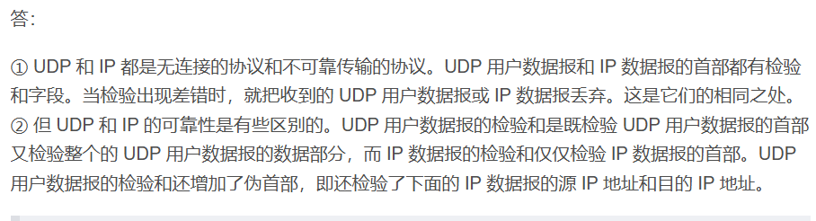

UDP和IP的不可靠程度是否相同？请加以解释。

### 5-53 UDP长度计算
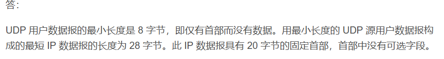

请计算：
1. UDP用户数据报的最小长度是多少？
2. 用最小长度的UDP用户数据报构成的最短IP数据报的长度是多少？

### 5-57 大数据传输
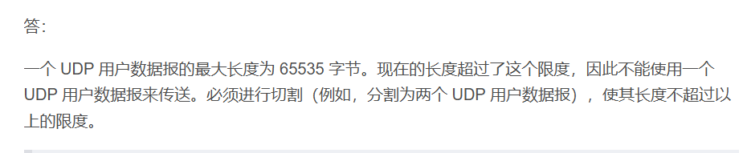

某客户有67000字节的分组。试说明怎样使用UDP用户数据将这个分组进行传送。
