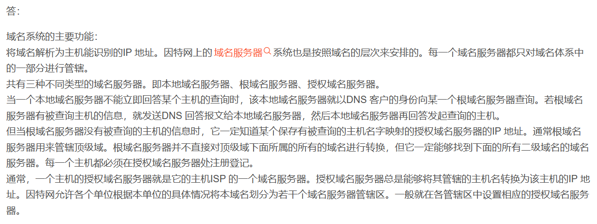
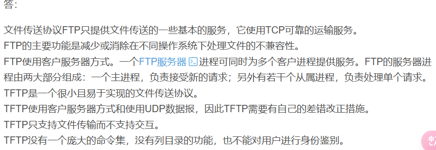
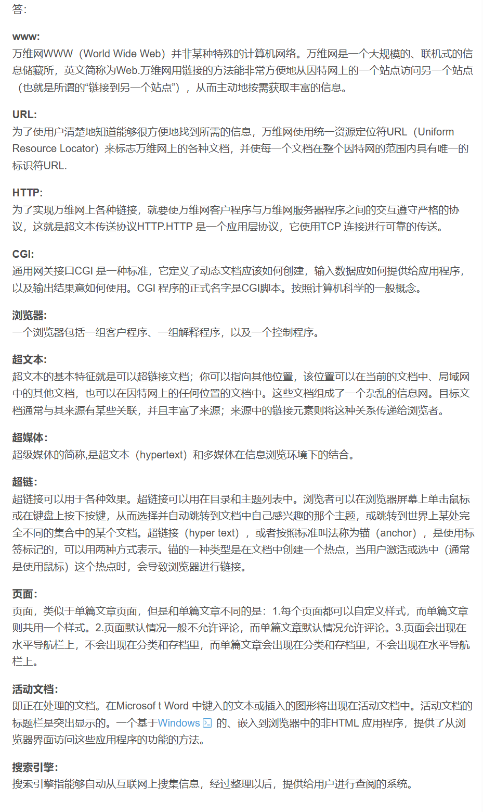
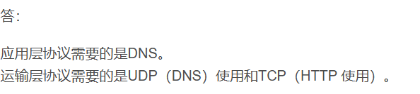

# 计算机网络基础 - 第六章习题

## 域名系统
### 6-02 DNS基础概念

请说明：
1. 域名系统的主要功能是什么？
2. 域名系统中以下服务器的区别：
   - 本地域名服务器
   - 根域名服务器
   - 顶级域名服务器
   - 权限域名服务器

### 6-03 域名解析过程

请回答：
1. 举例说明域名转换的过程
2. 域名服务器中的高速缓存的作用是什么？

## 文件传输协议
### 6-06 TFTP与FTP比较

简单文件传送协议TFTP与FTP的：
1. 主要区别是什么？
2. 各用在什么场合？

## 万维网技术
### 6-08 网络术语解释

解释以下名词（包括英文缩写词的原文）：
- www
- URL
- HTTP
- HTML
- CGI
- 浏览器
- 超文本
- 超媒体
- 超链
- 页面
- 活动文档
- 搜索引擎

### 6-09 错误处理机制
**问题**：假定一个超链从一个万维网文档链接到另一个万维网文档时，由于万维网文档上出现了差错而使得超链指向一个无效的计算机名字。这时浏览器将向用户报告什么？

**答案**：404 Not Found

### 6-10 URL访问协议

假定要从已知的URL获得一个万维网文档。若该万维网服务器的IP地址开始时并不知道。

**问题**：除HTTP外，还需要什么应用层协议和传输层协议？