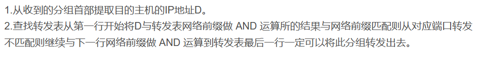

# 计算机网络基础 - 第四章习题

## 网络层基础概念
### 4-01 网络层服务
网络层向上提供的服务有哪两种？试比较其优缺点。

### 4-03 网络设备比较
作为中间设备，转发器、网桥、路由器和网关有何区别？

### 4-04 网络协议
试简单说明下列协议的作用：
- IP
- ARP
- ICMP

## IP数据报与分片
### 4-11 IP数据报格式

### 4-13 MTU概念
请回答：
1. 什么是最大传送单元MTU？
2. 它和IP数据报的首部中的哪个字段有关系？

### 4-15 数据报分片计算
已知条件：
- TCP报文长度：3200位
- IP首部长度：160位
- 第二个局域网最长数据帧数据部分：1200位

问：第二个局域网向其上层要传送多少比特的数据？

## IP地址与路由
### 4-19 地址块分配
已知条件：
- 地址块：129.250/16
- 机器数：4000台
- 分布：平均分布在16个不同地点

要求：给每一个地点分配地址块，并计算每个地址块的最小值和最大值。

### 4-21 路由查找
写出互联网的IP层查找路由的算法。

### 4-22 地址块聚合
有如下的4个/24地址块，试进行最大可能的聚合：
- 212.56.132.0/24
- 212.56.133.0/24
- 212.56.134.0/24
- 212.56.135.0/24

### 4-23 CIDR地址块分析
有两个CIDR地址块：
- 208.128/11
- 208.130.28/22

问：是否有某一个地址块包含了另一个？如果有请指出并说明理由。

### 4-24 路由聚合示例

### 4-28 地址前缀匹配
以下的地址前缀中哪一个与2.52.90.140匹配？请说明理由。
1. 0/4
2. 32/4
3. 4/6
4. 80/4

### 4-29 多地址匹配
以下地址前缀中哪一个和地址152.7.77.159及152.31.47.252都匹配？请说明理由。
1. 152.40/13
2. 153.40/9
3. 152.64/12
4. 152.0/11

# 什么是子网掩码

### 4-33 子网划分
已知条件：地址块136.23.12.64/26，需要划分为4个相同大小的子网。

请计算：
1. 每一个子网的网络前缀有多长？
2. 每一个子网中有多少个地址？
3. 每一个子网的地址块是什么？
4. 每一个子网可分配给主机使用的最小地址和最大地址是什么？

## 路由协议
### 4-34 路由协议分类

IGP和EGP这两类协议的主要区别是什么？

### 4-35 路由选择协议比较
试简述RIP、OSPF和BGP路由选择协议的主要特点。

### 4-36 传输协议选择
请分析：
1. RIP使用UDP、OSPF使用IP、而BGP使用TCP，这样做有何优点？
2. 为什么RIP周期性地和临站交换路由信息而BGP却不这样做？

## 网络技术
### 4-41 VPN技术

请回答：
1. 什么是VPN？
2. VPN有哪些特点和优缺点？
3. VPN有几种类别？

### 4-42 NAT技术

请回答：
1. 什么是NAT？
2. 什么是NAPT？
3. NAPT有哪些特点？
4. NAT的优点和缺点有哪些？

## 地址转换与计算
### 4-43 二进制转十进制

试把下列IPv4地址从二进制记法转换为点分十进制记法：
1. 10000001 00001011 00001011 11101111
2. 11000001 10000011 00011011 11111111
3. 11100111 11011011 10001011 01101111
4. 11111001 10011011 11111011 00001111

### 4-44 地址数量计算
已知：
- 首地址：146.102.29.0
- 末地址：146.102.32.255

求：这个地址段的地址数。

### 4-47 子网划分实例

某单位分配到地址块14.24.74.0/24，需要划分三个子网：
- N1需要120个地址
- N2需要60个地址
- N3需要10个地址

请给出地址块的分配方案。

### 4-49 地址计算示例

### 4-50 网络规划

### 4-56 IPv6地址空间计算
设每隔1微微秒就分配出100万个IPv6地址。试计算大约要用多少年才能将IPv6地址空间全部用光？可以和宇宙的年龄(大约有100亿年)进行比较。
